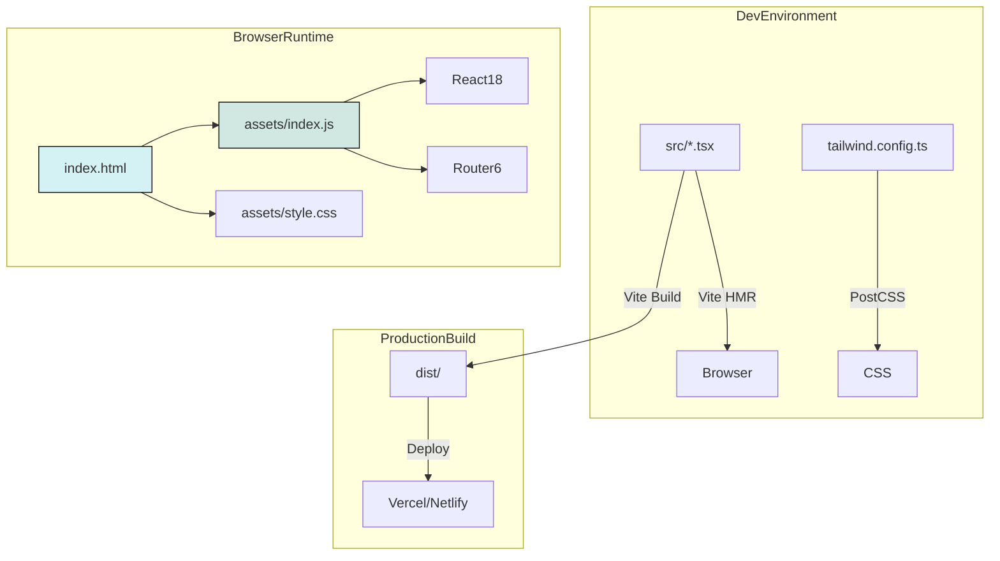
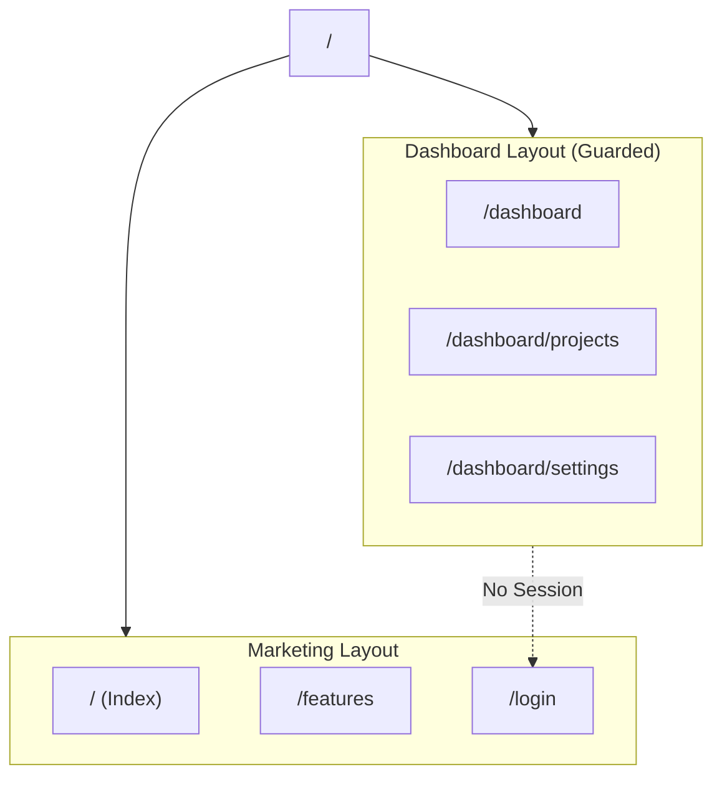

# Implementation Plan: fashionOS Remediation & Production Readiness

**Version:** 1.0.0
**Status:** 🏗️ In Progress
**Architecture:** Vite + React 18 + TypeScript + Tailwind (PostCSS)
**Routing:** React Router v6 (BrowserRouter)

---

## 1. Executive Summary

This plan addresses the **Critical Architecture Mismatch** identified in the audit. The current application attempts to mix a Vite build pipeline (Node.js) with a Browser-Native Import Map (CDN) approach. This results in version conflicts (React 18 vs 19), styling engines fighting (PostCSS vs CDN), and potential CORS failures.

**Core Objectives:**
1.  **Sanitize Architecture:** Remove all CDN/ImportMap dependencies; rely strictly on Vite + NPM.
2.  **Enable Clean Routing:** Migrate from `HashRouter` to `BrowserRouter` with proper SPA rewrites.
3.  **Prepare for Auth:** Structure the application for Supabase integration.
4.  **Ensure Production Readiness:** Establish type safety, linting, and correct build output.

---

## 2. Progress Tracker

| Stage | Task | Priority | Status | Owner |
| :--- | :--- | :--- | :--- | :--- |
| **1. Foundation** | **Remove ImportMaps & CDN Tailwind from `index.html`** | 🔴 Critical | **Done** | Dev |
| | Verify `postcss` and `tailwind.config` pipeline | 🔴 Critical | **Done** | Dev |
| | Fix `vite.config.ts` alias resolution | 🟡 High | **Done** | Dev |
| | **Acceptance Test:** Local build & render without console errors | 🔴 Critical | **Done** | Dev |
| **2. Routing** | Switch to `createBrowserRouter` (Clean URLs) | 🟡 High | **Done** | Dev |
| | Add `ErrorPage` and `NotFound` catch-all routes | 🟢 Low | **Done** | Dev |
| | **Acceptance Test:** Nested navigation works, History API works | 🟡 High | **Done** | Dev |
| **3. Integration** | Setup `lib/supabase.ts` client singleton | 🟡 High | **Todo** | Dev |
| | Replace mock auth with Supabase Session check | 🟡 High | **Todo** | Dev |
| | **Acceptance Test:** Env vars load, Client initializes | 🟡 High | **Todo** | Dev |
| **4. Deployment** | Create `vercel.json` (SPA Rewrites) | 🟡 High | **Done** | Dev |
| | Create `netlify.toml` (SPA Redirects) | 🟡 High | **Done** | Dev |
| | **Acceptance Test:** Production build succeeds | 🔴 Critical | **Todo** | Dev |
| **5. QA** | Run full Typecheck (`tsc --noEmit`) | 🟢 Low | **Todo** | Dev |
| | Verify Bundle Size and Chunks | 🟢 Low | **Todo** | Dev |

---

## 3. Architecture Diagrams

### Target Architecture (Fixed)

### Routing & Layout Map

---

## 4. Stage 1: Foundation (The Critical Fix)

**Goal:** Eliminate "Split-Brain" dependency model.

### 4.1 Actions
1.  **Sanitize `index.html`:**
    *   Remove ``.
    *   Remove ``.
    *   Ensure `

` exists.
    *   Ensure entry point `` is present.
2.  **Verify CSS Pipeline:**
    *   Ensure `src/styles/index.css` has `@tailwind` directives.
    *   Ensure `postcss.config.js` is present.
3.  **Align Versions:**
    *   Force usage of `package.json` versions (React 18).

### 4.2 Acceptance Criteria
*   [ ] Running `npm run dev` loads the app.
*   [ ] Browser Console is free of "CORS" errors.
*   [ ] Browser Console is free of "Multiple React Instances" warnings.
*   [ ] Inspecting Elements shows Tailwind classes applied via generated CSS (not inline styles or CDN).

---

## 5. Stage 2: App Structure & Routing

**Goal:** Implement professional routing standards (Clean URLs).

### 5.1 Actions
1.  **Update Router Configuration:**
    *   Modify `src/router/index.tsx`.
    *   Replace `createHashRouter` with `createBrowserRouter`.
2.  **Add Error Handling:**
    *   Create `src/pages/error/NotFound.tsx`.
    *   Add `errorElement` to root router config.

### 5.2 Acceptance Criteria
*   [ ] URL bar shows `domain.com/dashboard` instead of `domain.com/#/dashboard`.
*   [ ] Browser "Back" and "Forward" buttons work correctly.
*   [ ] Navigating to a non-existent route renders the NotFound component.

---

## 6. Stage 3: Supabase Wiring

**Goal:** Prepare application state for real authentication.

### 6.1 Actions
1.  **Client Setup:**
    *   Create `src/lib/supabase.ts`.
    *   Initialize `createClient` using `import.meta.env.VITE_SUPABASE_URL` and `VITE_SUPABASE_ANON_KEY`.
2.  **Auth Guard Update:**
    *   Update `src/components/ProtectedRoute.tsx` to check Supabase session instead of `localStorage`.
    *   (Optional) Add a loading spinner while checking session state.

### 6.2 Acceptance Criteria
*   [ ] App does not crash if Env Vars are missing (fails gracefully or logs warning).
*   [ ] `supabase` client object is importable.

---

## 7. Stage 4: Deployment Config

**Goal:** Ensure Single Page Application (SPA) routing works on static hosts.

### 7.1 Actions
1.  **Vercel:**
    *   Create `vercel.json` in root.
    *   Add rewrite rule: `source: "/(.*)", destination: "/"`.
2.  **Netlify:**
    *   Create `netlify.toml` in root.
    *   Add redirect rule: `from = "/*"`, `to = "/index.html"`, `status = 200`.

### 7.2 Acceptance Criteria
*   [ ] `npm run build` generates a `dist/` folder.
*   [ ] `dist/index.html` references hashed assets (e.g., `assets/index-Ah3...js`).
*   [ ] Direct access to nested routes (e.g., `/dashboard`) works in production preview.

---

## 8. QA & Hardening

**Goal:** Verify code quality and bundle health.

### 8.1 Actions
1.  **Typecheck:**
    *   Run `npx tsc --noEmit`. Fix any "Implicit Any" or path resolution errors.
2.  **Lint:**
    *   Run `npm run lint` (if configured) or ensure no ESLint errors in editor.

---

## 9. Troubleshooting & Common Failure Modes

### 9.1 White Screen of Death (WSOD)
*   **Symptom:** Blank page, console errors about "Uncaught TypeError" or "CORS".
*   **Fix:** You likely still have the ImportMap in `index.html`. Remove it. Ensure you are running via `npm run dev` (Vite), not opening `index.html` directly in Chrome.

### 9.2 Styles Missing / Ugly Layout
*   **Symptom:** HTML structure exists but looks unstyled.
*   **Fix:**
    1.  Check `src/main.tsx` imports `./styles/index.css`.
    2.  Check `tailwind.config.ts` `content` array includes `./src/**/*.{ts,tsx}`.
    3.  Ensure `postcss.config.js` exports `tailwindcss`.

### 9.3 404 on Refresh (Production/Preview)
*   **Symptom:** Navigating to `/dashboard` works, but refreshing the page shows a 404 error.
*   **Fix:** Missing SPA Rewrite configuration. Ensure `vercel.json` or `netlify.toml` exists and is in the build root.

---

## 10. Definition of Done

The application is considered "Production Ready" (v1.0) when:
1.  [ ] `index.html` is clean (No CDN/ImportMaps).
2.  [ ] `npm run build` succeeds without errors.
3.  [ ] `npm run preview` works locally with full functionality.
4.  [ ] URLs are clean (`BrowserRouter`).
5.  [ ] Tailwind styles load correctly via the build pipeline.
6.  [ ] No Type errors in strict mode.