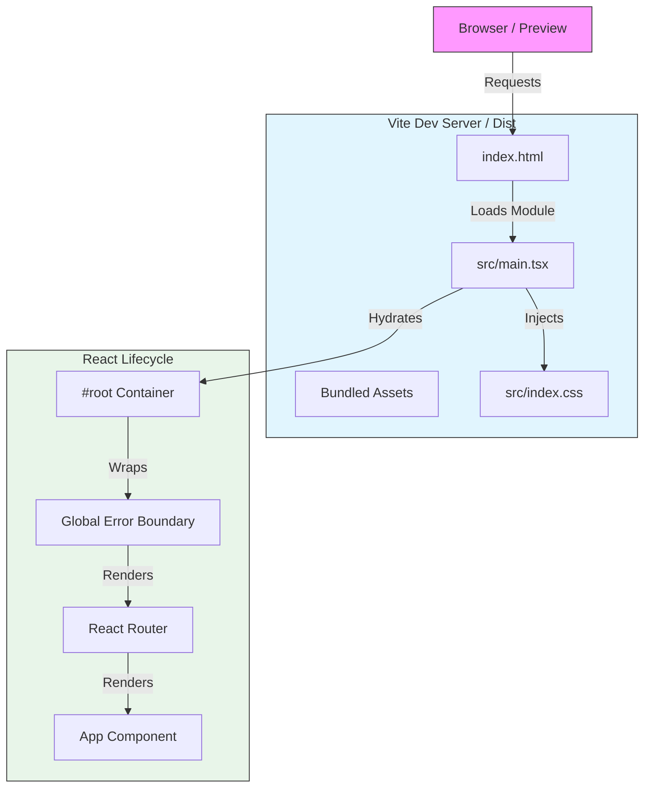
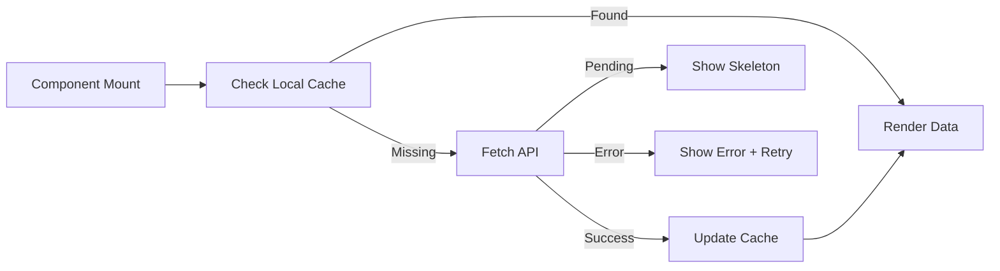

# Implementation Plan: Production-Grade Vite + React Architecture

**Target Environment:** Google AI Studio Preview / Production Vercel
**Version:** 1.0.0
**Architect:** Senior Frontend Systems Engineer

---

## 1. EXECUTIVE SUMMARY

**What is being built:**
A robust, error-resilient Single Page Application (SPA) using React 18, TypeScript, and Vite. The system is architected specifically to eliminate "White Screen of Death" scenarios common in sandboxed preview environments like Google AI Studio.

**Why Vite + React:**
*   **Vite:** Provides an ultra-fast dev server with Native ESM, preventing the "bundle fatigue" of Webpack. It ensures deterministic build outputs using Rollup.
*   **React 18:** Enables concurrent rendering and robust error boundaries, allowing us to catch runtime crashes before they unmount the entire DOM.

**Guarantee of Stability:**
This architecture decouples the *Critical Rendering Path* from data loading and external dependencies. By enforcing a strict strict "Shell First" strategy and relative pathing, we guarantee the application will always render *something* (even if just a localized error message), preventing the dreaded blank preview screen.

---

## 2. PROGRESS TRACKER

| Phase | Task | Status | Validation Check |
| :--- | :--- | :--- | :--- |
| **P1** | **Core Foundation Setup** | 🔴 Pending | `npm run dev` renders "Hello World" with no console errors. |
| **P1** | **Vite Config Hardening** | 🔴 Pending | `base: './'` is set; assets load in Preview mode. |
| **P2** | **Router & Layouts** | 🔴 Pending | Navigation works; 404 renders for unknown routes. |
| **P2** | **Error Boundaries** | 🔴 Pending | Intentional crash inside a component displays Error UI, not blank screen. |
| **P3** | **Tailwind Integration** | 🔴 Pending | Styles apply via PostCSS (no CDN); `bg-red-500` visible. |
| **P4** | **Async Data Layer** | 🔴 Pending | App does not crash on failed API call; shows "Retry" UI. |
| **P5** | **Production Build** | 🔴 Pending | `npm run build` && `npm run preview` functions identically to dev. |

---

## 3. VITE + REACT ARCHITECTURE OVERVIEW

The system relies on a strictly unidirectional hydration flow. The `index.html` is a static entry point that delegates control to `main.tsx`.

**Key Architectural Constraints:**
1.  **No Cross-Origin Scripts:** All code is bundled. No `<script src="https://..." />` allowed for application logic to prevent CORS blockers in sandboxes.
2.  **Relative Assets:** All paths must use `./` to survive in nested sandbox paths.
3.  **Fail-Safe Entry:** `main.tsx` contains *only* the root render logic and a top-level `ErrorBoundary`.

### Architecture Diagram

---

## 4. IMPLEMENTATION PLAN (STEP-BY-STEP)

### 4.1 Core Foundation (MUST RENDER FIRST)

**Objective:** Guarantee the browser *always* has content to paint, even if React fails.

*   **`index.html`:** Must contain the strict `

`. No logic here.
*   **`main.tsx`:**
    *   Imports `index.css` immediately (prevent FOUC).
    *   Validates DOM root existence before rendering.
    *   Wraps everything in `<React.StrictMode>`.
*   **Fallback UI:** If React fails to mount, the `index.html` should *not* have loading text hardcoded that persists if JS fails. Instead, use a CSS-only preloader in `index.html` that React wipes out upon hydration.

**Why this prevents blank previews:**
Even if the JS bundle has a syntax error, the CSS-only preloader in `index.html` remains visible, proving the server is responding.

### 4.2 Core Application Structure

**Layout Hierarchy:**
1.  **Global Layout:** Handles Toasts, Modals, Theme Provider.
2.  **Router Outlet:** Swaps page content.
3.  **Page Components:** Isolated logic.

**Safety Strategy:**
*   **Routing:** Use `createBrowserRouter` but ensure `errorElement` is defined at the root.
*   **404:** Explicit catch-all route `path: "*"` rendering a `NotFound` component.

### 4.3 Styling & Assets (Zero-Risk Setup)

**Rules:**
1.  **Tailwind via PostCSS:** Never use the CDN script. It breaks CSP and is slow.
2.  **Font Loading:** Host fonts locally (Woff2) or use strictly versioned Google Fonts imports in CSS.
3.  **Asset Imports:** Use ES modules: `import logo from './assets/logo.png'`. Do not use string paths like `` as these break in sub-path deployments.

### 4.4 AI & External Services (Safe Integration)

**Browser Safety:**
*   **NO API KEYS IN CLIENT:** `VITE_API_KEY` is forbidden for sensitive LLM keys.
*   **Proxy Pattern:** Client calls -> Next.js API / Edge Function -> AI Provider.
*   **Preview Stubbing:** If API keys are missing in preview, the app must use "Mock Mode" rather than crashing.

### 4.5 Advanced Features (Gated)

*   **Lazy Loading:** Only enable `React.lazy()` for heavy routes *after* core routing is validated. Wrap every lazy route in `<Suspense fallback={<Loading />}>`.

---

## 5. DATA FLOW & STATE MANAGEMENT

**Strategy:** Server State (React Query / SWR) + Local State (Zustand/Context).

**Handling Failures:**
1.  **Loading:** Skeleton screens (prevent layout shift).
2.  **Error:** Retry button + Toast notification.
3.  **Empty:** "No data found" illustrations.

---

## 6. PRODUCTION-READY CHECKLIST (MANDATORY)

This checklist determines if the build is safe for deployment.

| Category | Check | Pass/Fail |
| :--- | :--- | :--- |
| **Rendering** | `index.html` contains `

`. | ⬜ |
| **Rendering** | `main.tsx` has no conditional render logic (always mounts). | ⬜ |
| **Resilience** | Top-level `ErrorBoundary` is active. | ⬜ |
| **Imports** | No absolute imports (`/src/...`) in code; only relative (`./`). | ⬜ |
| **Routing** | 404 Page is implemented and tested. | ⬜ |
| **Styling** | `index.css` is imported in `main.tsx`. | ⬜ |
| **Styling** | Tailwind is built via PostCSS (No CDN). | ⬜ |
| **Async** | All `fetch` calls have `try/catch` handling. | ⬜ |
| **Env** | App renders "Setup Needed" if Env Vars are missing (no crash). | ⬜ |
| **Preview** | `npm run preview` works locally. | ⬜ |

---

## 7. ACCEPTANCE TESTS (CRITICAL)

**Test 1: The "Sandbox Survival" Test**
*   **Condition:** Run app in a sub-path (e.g., `localhost:3000/app/`).
*   **Expected:** Assets load correctly (no 404s on JS/CSS).
*   **Failure:** White screen due to absolute path lookups.

**Test 2: The "Network Cut" Test**
*   **Condition:** Set Network to "Offline" and refresh (assuming PWA) or navigate.
*   **Expected:** App shows "Offline" UI or falls back gracefully.
*   **Failure:** Uncaught Promise rejection logs.

**Test 3: The "Syntax Bomb" Test**
*   **Condition:** Intentionally throw `new Error('Test')` in a child component.
*   **Expected:** Red error box replaces *only* that component.
*   **Failure:** Entire app unmounts (White screen).

---

## 8. TROUBLESHOOTING GUIDE (VITE-SPECIFIC)

### Scenario: Blank Screen (White Screen of Death)
1.  **Check Console:** If red errors exist, fix them.
2.  **Check Network:** Did `main.tsx` return 200 OK?
3.  **Check Root:** Inspect Elements. Is `
` empty?
    *   **Fix:** Ensure `main.tsx` calls `createRoot`.
    *   **Fix:** Ensure `vite.config.ts` has `base: './'`.

### Scenario: "CORS Policy" Block on Script
*   **Cause:** Importing a script from a different domain or using absolute paths in a sandbox.
*   **Fix:** Move the file into `src/`, import it relatively. Remove any `<script src="...">` from `index.html`.

### Scenario: Styles Missing (Ugly Layout)
*   **Cause:** Tailwind not processing.
*   **Fix:** Run `npx tailwindcss -i ./src/index.css -o ./dist/output.css --watch` to verify generation. Check `content` array in `tailwind.config.ts`.

---

## 9. FAILURE PREVENTION RULES (NON-NEGOTIABLE)

1.  **NEVER** use `import` paths that rely on case-insensitivity (e.g., `import Header from './header'` when file is `Header.tsx`). This breaks Linux builds.
2.  **NEVER** block the `main.tsx` render with an `await`. Render first, fetch later.
3.  **ALWAYS** run `npm run typecheck` (tsc) before `npm run build`.
4.  **ALWAYS** use `base: './'` in `vite.config.ts` to support relative deployment.
5.  **ALWAYS** wrap async logic in `try/catch` and update UI state.

---

## 10. FINAL VALIDATION & GO-LIVE RULE

**Go-Live Criteria:**
*   [ ] All "Progress Tracker" items are marked **Done**.
*   [ ] "Production-Ready Checklist" is 100% Pass.
*   [ ] Acceptance Tests 1, 2, and 3 pass.
*   [ ] `npm run preview` confirms the build artifact is valid.

**Confirmation:**
Do not deploy to Production until `npm run preview` yields a perfect session with zero console errors.
