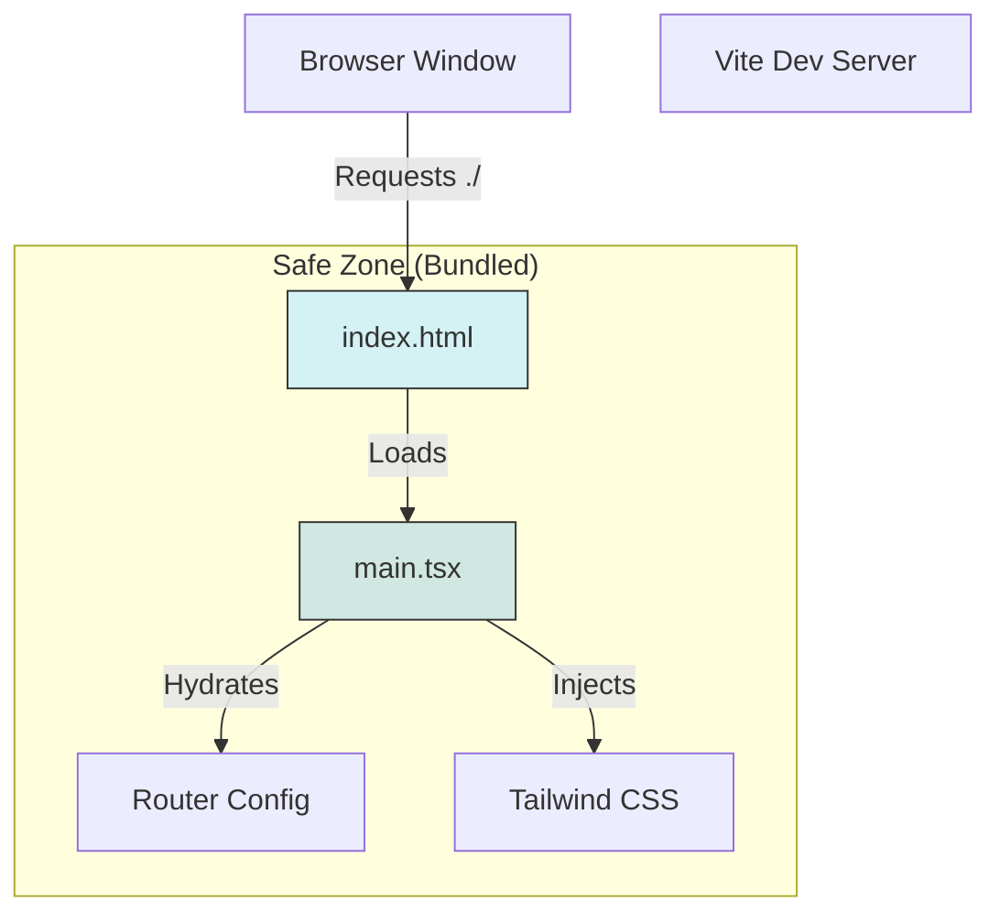

# Multi-Step Project Implementation Prompts

**Target Architecture:** Vite + React + TypeScript + Tailwind (PostCSS)
**Goal:** Zero "Blank Screen" errors in Google AI Studio Preview.

---

## 1. EXECUTIVE OVERVIEW

**What is being built:**
A production-grade, dual-layout Single Page Application (SPA). It features a public **Marketing Site** and a secured **Dashboard**, built on a "Fail-Loud" architecture that guarantees visible UI elements even during critical data failures.

**Why Vite + React:**
*   **Vite:** Ensures deterministic builds and instant HMR (Hot Module Replacement), solving the "it works in dev but breaks in build" paradox common with older bundlers.
*   **React 18:** Provides the component boundaries necessary to catch runtime errors without crashing the entire browser tab.

**Prevention Strategy:**
This setup strictly enforces **Relative Pathing** (`./`) and **Bundled Assets**. This eliminates the #1 cause of blank previews: the browser attempting to load scripts from the domain root (`/src/...`) instead of the project folder.

---

## 2. MULTI-STEP PROJECT SETUP PROMPTS

Use these prompts in order to scaffold or refactor the application.

### STEP 1 — Project Scaffolding (Safe Defaults)

**Prompt:**
> "Initialize the project core. Update `vite.config.ts` to set `base: './'` for safe relative path loading. Update `index.html` to be a pure static shell with `<div id='root'></div>` and NO external script tags or Import Maps. Update `main.tsx` to mount the app inside `React.StrictMode` with a non-null assertion on the root element. Ensure no code runs before the DOM is ready."

**Validation:**
*   [ ] `npm run dev` starts without error.
*   [ ] Browser console is empty (no Red errors).
*   [ ] View Source shows `<script type="module" src="./src/main.tsx">`.

### STEP 2 — Styling Engine (Zero-CDN)

**Prompt:**
> "Set up the styling engine using Tailwind CSS via PostCSS. Create `postcss.config.js` and `tailwind.config.ts`. Configure the content array to scan `./src/**/*.{ts,tsx}`. Create `src/styles/index.css` containing the three `@tailwind` directives. Import this CSS file at the very top of `src/main.tsx`. Do NOT add any CDN links for Tailwind in index.html."

**Validation:**
*   [ ] `src/styles/index.css` exists.
*   [ ] Adding `className="bg-red-500"` to a div makes it red.

### STEP 3 — App Shell & Error Boundaries (Never Blank)

**Prompt:**
> "Create a `src/components/error/ErrorBoundary.tsx` component that catches runtime errors and displays a 'Something went wrong' UI. Create `src/App.tsx` as a pass-through shell. Update `main.tsx` to wrap the entire React tree in the ErrorBoundary. This ensures that if a child component crashes, the user sees an error message instead of a white screen."

**Validation:**
*   [ ] Intentionally throwing an error in a component renders the Error UI.

### STEP 4 — Routing Architecture (Marketing vs Dashboard)

**Prompt:**
> "Set up `react-router-dom` with `createBrowserRouter`. Create two distinct layout components: `src/layouts/MarketingLayout.tsx` (Navbar + Footer) and `src/layouts/DashboardLayout.tsx` (Sidebar + Header). Configure the router in `src/router/index.tsx` to use these layouts as wrappers for their respective child routes. Add a wildcard `*` route that renders a `NotFound` component."

**Validation:**
*   [ ] Navigating to `/` shows the Marketing Header.
*   [ ] Navigating to `/dashboard` shows the Sidebar.
*   [ ] Navigating to `/random-junk` shows the 404 page.

### STEP 5 — Page Placeholders (Visual Verification)

**Prompt:**
> "Create robust placeholder page components: `src/pages/marketing/Home.tsx`, `src/pages/dashboard/Overview.tsx`, and `src/pages/auth/Login.tsx`. Each component must return a `<div>` with a visible `<h1>` identifying the page. Do NOT return `null` or fragments `<></>` effectively ensuring every route paints pixels to the screen."

**Validation:**
*   [ ] Every route displays unique text content.
*   [ ] Layouts persist while switching pages.

### STEP 6 — Import Path Safety (The "Linux" Rule)

**Prompt:**
> "Audit all imports. Ensure all internal imports use relative paths (e.g., `./components/Button`) or configured aliases (e.g., `@/components/Button`) consistent with `tsconfig.json`. Ensure file casing matches exactly (e.g., do not import `button` if file is `Button.tsx`)."

**Validation:**
*   [ ] `npm run build` passes on a Case-Sensitive file system (Linux/CI).

---

## 3. MERMAID DIAGRAMS

### Architecture Diagram



### Routing Diagram

```mermaid
graph TD
    Root[/] --> Marketing[Marketing Layout]
    Root --> Dashboard[Dashboard Layout]
    Root --> Error[404 Fallback]

    Marketing --> Home[Home Page]
    Marketing --> Login[Login Page]
    
    Dashboard --> Overview[Overview Page]
    Dashboard --> Settings[Settings Page]
```

---

## 4. VALIDATION & ACCEPTANCE TESTS

| Test ID | Action | Expected Outcome | Failure Meaning |
| :--- | :--- | :--- | :--- |
| **VAT-01** | Open Root URL | Marketing Layout & Home Page visible | Routing config broken. |
| **VAT-02** | Click "Dashboard" | Sidebar appears, URL changes to `/dashboard` | Layout nesting broken. |
| **VAT-03** | Enter Bad URL | 404 Component renders | Wildcard route missing. |
| **VAT-04** | Check Network Tab | No failed 404 requests for JS/CSS | Absolute paths used in `index.html`. |
| **VAT-05** | `npm run build` | `dist/` folder created with hashed assets | TypeScript errors present. |

---

## 5. TROUBLESHOOTING (PREVIEW-SAFE)

### Problem: Blank Screen in Preview
*   **Cause:** Vite default `base` is `/` (root domain). In preview, your app is often at `domain.com/user/project/`.
*   **Fix:** Set `base: './'` in `vite.config.ts`.

### Problem: Styles Not Loading
*   **Cause:** Tailwind directives missing or file not imported.
*   **Fix:** Ensure `import './styles/index.css'` is the **first** import in `main.tsx`.

### Problem: "CORS" Error on Script
*   **Cause:** `<script src="/src/main.tsx">` in `index.html`.
*   **Fix:** Change to `<script src="./src/main.tsx">` (Dot-Slash).

---

## 6. FINAL CHECKLIST (GO / NO-GO)

Before marking the setup as "Complete":

- [ ] **Renderer:** `index.html` has `<div id="root">`.
- [ ] **Config:** `vite.config.ts` has `base: './'`.
- [ ] **Routing:** `createBrowserRouter` is used.
- [ ] **Styling:** PostCSS is configured, no CDNs.
- [ ] **Safety:** `ErrorBoundary` wraps the App.
- [ ] **Visuals:** All 4 main routes render visible text.
