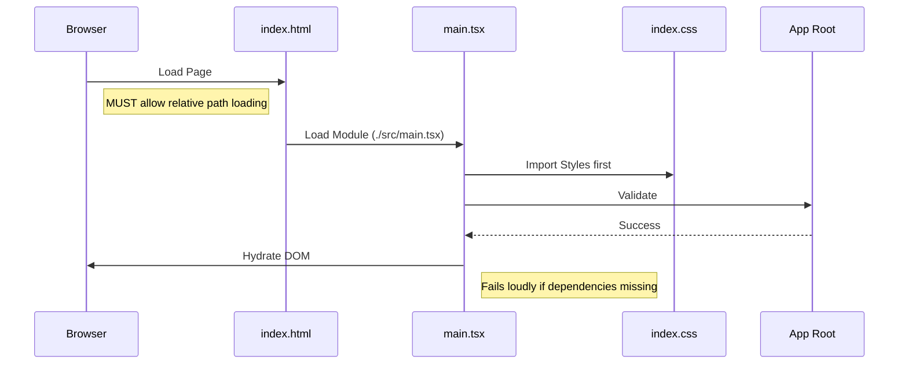
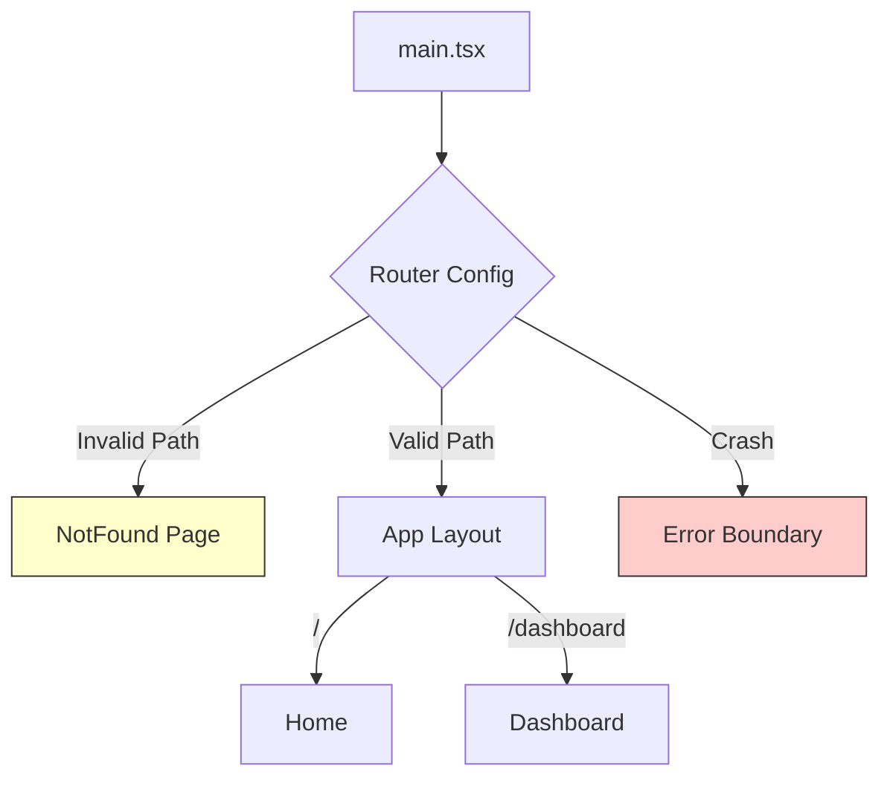

# Production-Ready Setup Checklist (Vite + React)

**Version:** 2.0
**Target:** High-Availability SPAs
**Focus:** Stability, Performance, and "No-Blank-Screen" Guarantee

---

## 1. 🏗️ CORE ARCHITECTURE (The "No-Blank-Screen" Foundation)

This section ensures the application boot sequence is robust enough to survive in sandboxed environments (Google AI Studio, StackBlitz) and sub-path deployments.

- [ ] **Vite Base Path:** `vite.config.ts` must have `base: './'`.
    *   *Why:* Prevents browser from looking at domain root (`/assets`) when app is hosted at `domain.com/app/`.
- [ ] **Relative Entry:** `index.html` script source is `./src/main.tsx` (not `/src/main.tsx`).
    *   *Why:* Absolute paths trigger CORS blocks in sandboxes.
- [ ] **Clean HTML Shell:** `index.html` contains **ONLY** `<div id="root"></div>` and the entry script.
    *   *Rule:* No `<script src="https://cdn...">` tags. All dependencies must be in `package.json`.
- [ ] **Fail-Safe Mounting:** `main.tsx` verifies root existence before rendering.
    *   *Code:* `if (!root) throw new Error("Root not found");`
- [ ] **Strict Mode:** App is wrapped in `<React.StrictMode>`.

### Safe Boot Flow Diagram



---

## 2. 🛡️ ROUTING & NAVIGATION (Zero Dead Ends)

- [ ] **Router Selection:** Use `createBrowserRouter` (DOM History API) over `HashRouter`.
- [ ] **Catch-All Route:** A generic `path: "*"` route exists to render a 404 page.
    *   *Why:* Prevents blank screens when users mistype URLs.
- [ ] **Error Boundaries:** The Root Route has an `errorElement` configured.
    *   *Why:* Catches render crashes in child pages without unmounting the whole app.
- [ ] **Layout Wrapping:** Pages are children of Layout components (not standalone).
    *   *Benefit:* Persists navigation/state during page transitions.

### Routing Safety Diagram



---

## 3. 🎨 STYLING & ASSETS (Zero-CDN Policy)

- [ ] **Tailwind Config:** `content` array includes `['./src/**/*.{ts,tsx}']`.
- [ ] **PostCSS Pipeline:** `postcss.config.js` is present and active.
- [ ] **CSS Entry:** `src/styles/index.css` contains `@tailwind` directives.
- [ ] **Import Order:** CSS is imported **before** the Router in `main.tsx`.
    *   *Why:* Ensures global styles apply to fallback error pages.
- [ ] **Asset Imports:** Images are imported as modules (`import logo from './logo.png'`).
    *   *Rule:* Never use string literals like `` in code.

---

## 4. 🧹 CODE QUALITY & TYPESCRIPT

- [ ] **Strict Mode:** `tsconfig.json` has `"strict": true`.
- [ ] **Alias Resolution:** `tsconfig.json` paths (`@/*`) match `vite.config.ts`.
- [ ] **Linter:** ESLint is configured for React Hooks & Accessibility.
- [ ] **No "Any":** Avoid `any` types; use `interface` or `type` for all props.
- [ ] **Barrel Files:** Use `index.ts` carefully to group related exports (e.g., `components/ui/index.ts`).

---

## 5. 🚀 PRODUCTION BUILD VERIFICATION

Before pushing to production, run this gauntlet.

- [ ] **Type Check:** `npm run typecheck` (tsc --noEmit) passes with 0 errors.
- [ ] **Build:** `npm run build` generates a `dist/` folder.
- [ ] **Preview:** `npm run preview` launches the app locally.
    *   *Critical:* Open the preview URL. **If it's blank, DO NOT DEPLOY.**
- [ ] **SPA Fallback:**
    *   **Vercel:** `vercel.json` has `rewrites: [{ source: "/(.*)", destination: "/" }]`.
    *   **Netlify:** `netlify.toml` has `redirects`.
    *   *Why:* Ensures reloading `/dashboard` doesn't return a 404 from the server.

---

## 6. 📂 FOLDER STRUCTURE STANDARD

Maintain predictable navigation for new developers.

```text
src/
├── app/                 # Global app setup (Providers, Router)
├── assets/              # Static images/fonts (Imported only)
├── components/
│   ├── ui/              # Reusable atoms (Button, Input) - Shadcn style
│   ├── layout/          # Headers, Sidebars
│   └── features/        # Business-logic rich components
├── hooks/               # Custom React hooks
├── lib/                 # Utilities, API clients (Supabase, Axios)
├── pages/               # Route views (Marketing, Dashboard)
├── styles/              # Global CSS
└── types/               # TypeScript definitions
```

---

## 7. 🚨 TROUBLESHOOTING "BLANK SCREENS"

If the app is blank, follow this priority sequence:

1.  **Check Console:** "Module not found"? -> Check Import Paths (Case Sensitivity!).
2.  **Check Console:** "CORS" / "Script Error"? -> Check `base: './'` in Vite config.
3.  **Check Network:** `main.tsx` 404? -> Check `index.html` script tag source.
4.  **Check DOM:** `#root` is empty? -> `main.tsx` crashed before rendering. Check top-level imports.

---

## 8. FINAL GO-LIVE CONFIRMATION

| Check | Requirement | Status |
| :--- | :--- | :--- |
| **Sandbox** | App loads in Google AI Studio / StackBlitz without config changes. | ⬜ |
| **Performance** | Lighthouse Performance score > 90 (Mobile). | ⬜ |
| **Accessibility** | No `aria-*` console warnings. Keyboard navigation works. | ⬜ |
| **Resilience** | Disconnecting network shows "Offline" state or handles error gracefully. | ⬜ |

