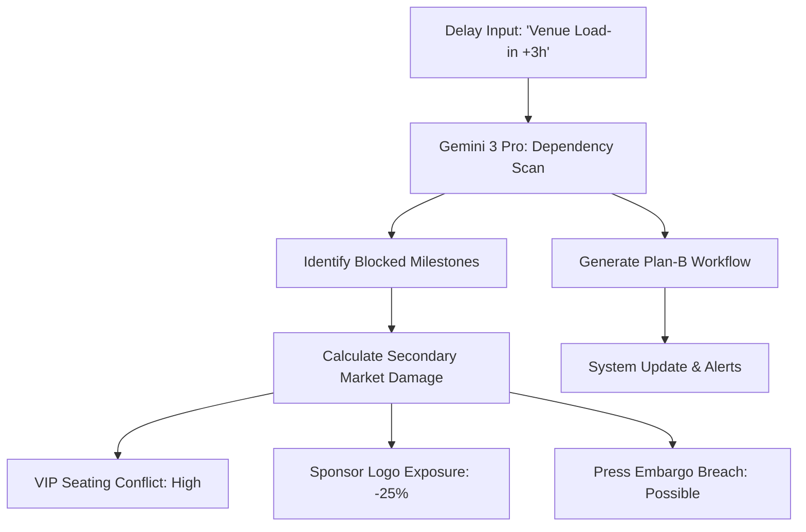

# fashionOS: AI Task Orchestration & Risk Engineering

**Version:** 1.0  
**Context:** High-Stakes Event Production  
**Goal:** Zero-Chaos "Show Day" Execution  

This document outlines the systematic prompts and logic flows for the autonomous workflow engine.

---

## 🚀 The Orchestrator Brief (Prompt Engineering)

To generate a perfect 120-task show workflow, use this multi-step reasoning prompt:

> "System Instruction: You are the Chief of Staff for a luxury fashion house. 
> 1. Consume the project brief: [USER_INPUT].
> 2. Decompose into 4 critical phases: Concept, Sourcing, Production, Logistics.
> 3. For each phase, identify 3 'Load-Bearing' tasks.
> 4. For each task, generate a sub-checklist that includes compliance (ESG), technical (Lighting/AV), and talent (Casting) requirements.
> 5. Identify cross-phase dependencies (e.g., Task A must finish for Task B to start).
> 6. Output strictly in JSON for system ingestion."

---

## 📊 Logic Flow: Dependency Cascade

When a user triggers the **Cascade Simulator**, the logic follows this path:

---

## 🧠 Gemini 3 Pro Features & Tools

| Feature | Tool Configuration | Implementation |
| :--- | :--- | :--- |
| **Critical Path Detection** | `thinkingBudget: 12000` | Uses multi-step reasoning to find the "Show Stopper" chain. |
| **Market-Grounded Tasks** | `tools: [googleSearch]` | Infers local logistics based on real-world city constraints (Tokyo vs Paris). |
| **Live Cue Orchestration** | `FunctionCalling` | Real-time state updates between the Event Hub and the Task Registry. |
| **Visual Verification** | `inlineData (Image)` | Director's Console analyzes backstage photos to verify task completion. |

---

## 🌑 User Journey: The "Show Stopper" Resolution

1.  **Detection**: The **Risk Guardian** (Autonomous Agent) detects a delay in "Textile Analysis."
2.  **Alert**: Director receives a "Critical Path Violation" notification on the dashboard.
3.  **Simulation**: Director opens the **Risk Center**, types "What if we use alternative bio-silk?", and simulates the outcome.
4.  **Mitigation**: AI suggests an alternative vendor from the **Intelligence Lab** archives and updates the wholesale buy-sheet to reflect the margin change.
5.  **Execution**: Director voice-commands "Accept mitigation," and the system updates 15 related tasks and notifies the Sourcing Team.

---

**Acceptance Criteria for Production:**
- [ ] Critical Path Scan returns task IDs in under 8 seconds.
- [ ] Simulation identifies at least 2 non-obvious secondary impacts.
- [ ] Task Orchestrator JSON passes validation for deep-nested subtasks.