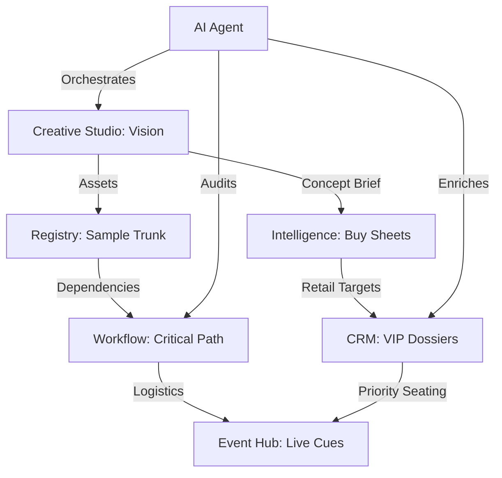

# fashionOS: Command & Control Architecture

**Version:** 1.0  
**Domain:** Enterprise Luxury Resource Planning (ELRP)  

## 1. Dashboard Network Overview

| Module | Purpose | Primary Stakeholder |
| :--- | :--- | :--- |
| **Command Center (Home)** | Real-time project health & daily AI brief. | Director |
| **Creative Studio** | Visual synthesis & sustainability auditing. | Creative Lead |
| **Workflow Control** | Critical path analysis & risk engineering. | Production Manager |
| **Registry (Projects)** | Digital Trunk & sample continuity. | Logistics |
| **Intelligence Hub** | Commercial strategy & wholesale mapping. | CFO / Retail Lead |
| **Relationships (CRM)** | Influence dossiers & relationship graphing. | PR / VIP Relations |

---

## 2. Integrated Data Flow

---

## 3. Core Logic: The Digital Twin

In **fashionOS**, every physical asset (e.g., Look 01 Suit) is mapped to its Digital Twin.

1.  **Creation**: Gemini 3 Pro generates the visual concept.
2.  **Archival**: Look is saved to the Registry with unique metadata (ID: S-001).
3.  **Logistics**: Workflow tracks the sample's location (Paris -> NYC).
4.  **Commercial**: Intelligence maps the sample to wholesale price tiers.
5.  **Event**: Live Cue Sheet triggers lighting cues when the sample enters the runway.

---

## 4. Key AI Capabilities

- **Deep Thinking (Pro)**: Used for multi-step reasoning in **Critical Path** and **Commercial Strategy**.
- **Fast Reasoning (Flash)**: Used for real-time **Workflow Synthesis** and **Transcription**.
- **Grounding (Search)**: Used in **Intelligence** and **CRM** to ensure market data and person dossiers are up-to-date.
- **Speech (TTS)**: The Director's daily strategic briefing.
- **Vision (Imagen/Veo)**: Editorial and motion editorial synthesis.