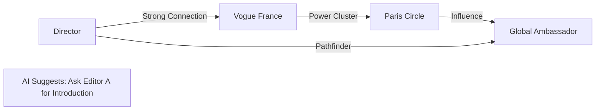

# fashionOS: Relationship Intelligence & Influence Mapping

**Version:** 1.0  
**Focus:** Turning Data into Relationship Capital  

The CRM module isn't just a database; it's a **Living Relationship Engine**.

---

## 🚀 Feature: Deep Profile Enrichment

When a name or LinkedIn URL is input, the **Research Agent** triggers:

1.  **Search Grounding**: Queries latest brand affiliations and press mentions.
2.  **Sentiment Synthesis**: Analyzes past event attendance vs. social mentions.
3.  **Dossier Generation**: Creates a "Strategic Approach" for the Director (e.g., "Julianne prefers private viewings over large gala events").

---

## 🧠 Influence Graphing (The Network Effect)

The system visualizes "Power Clusters" where influential nodes intersect:

---

## 🛠️ Automated Workflows

- **Gifting Engine**: Matches "Detected Preferences" (e.g., Loves Minimalist) to the Registry's current samples.
- **Outreach Orchestrator**: Uses **Context Retrieval** to draft personalized show invites based on the last 3 interactions.
- **Sentiment Guard**: Flags "Cooling Relationships" if a key stakeholder hasn't been engaged in 60 days.

---

**Acceptance Criteria for Production:**
- [ ] Enrichment Dossier returns in under 6 seconds.
- [ ] Network clusters are inferred from cross-module interactions (Events + Registry).
- [ ] Influence Tiering matches the "High-Touch" luxury model (VIP vs. Press).